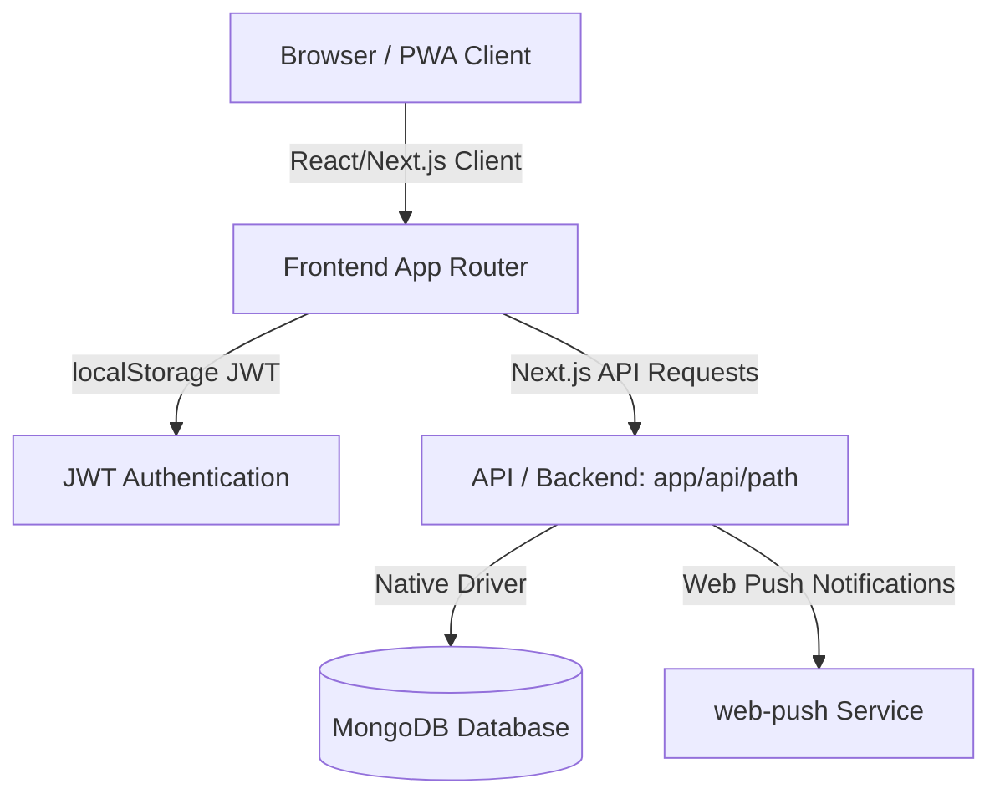

# Production-Readiness Audit Report: Language Scoop

## 1. Executive Summary
**Status: READY AFTER CRITICAL FIXES**

Language Scoop is a student and class management web application built for a French language tutor. A comprehensive production-readiness audit was performed in audit-only mode on the codebase. 

While the application compiles successfully, runs reliably, and has passed all 16 integration tests, it contains **one critical security vulnerability** (stored XSS via unrestricted file uploads) and **one high-security concern** (unauthenticated public file access). Furthermore, there are gaps between the requested features (such as class packs and password reset flows) and the actual implementation. 

Once the critical pre-production issues (P0) detailed in this report are corrected, the application will be ready for client deployment.

---

## 2. Application Architecture

### Stack Details
*   **Frontend**: React 18.3.1, Next.js 15.5.18 (App Router), TailwindCSS, Shadcn UI, Lucide Icons.
*   **Backend**: Next.js API Routes (serverless catch-all route at `app/api/[[...path]]/route.js`).
*   **Database**: MongoDB (Schema-less, native `mongodb` Node.js client driver).
*   **Storage**: In-database MongoDB storage (files are base64-encoded and stored directly inside the `files` collection).
*   **Authentication**: Stateless JWT-based authentication. Tokens are stored in the client's `localStorage` and sent in the `Authorization` header.
*   **External Integrations**: Web Push notification gateway using the `web-push` library. No external email or payment processors are currently integrated (payments are recorded manually by the teacher).
*   **PWA Compliance**: Features a configured web app manifest (`manifest.json`) and a custom service worker (`sw.js`) for asset caching and notification handling.

---

## 3. Checks Executed

| Check | Command/Method | Result | Notes |
| :--- | :--- | :--- | :--- |
| **Dependency Install** | `npm install` | **PASSED** | Added 303 packages. Generated `package-lock.json`. |
| **Development Startup** | `npm run dev:local` | **PASSED** | Started successfully using local MongoDB Memory Server at port 3000. |
| **Production Build** | `npm run build` | **PASSED** | Compiled client-side pages and API routes cleanly without warnings. |
| **Linting** | `npx next lint` | **PASSED** | The linter exited without reporting syntax or critical code warnings. |
| **Security Audit** | `npm audit` | **WARNING** | Flagged 3 vulnerabilities (1 moderate in `postcss`, 2 high in `sharp`). |
| **Integration Tests** | `python backend_test.py` | **PASSED** | 16/16 tests passed successfully both locally and on the staging URL. |
| **Database Audit** | Scratch script run via Node | **PASSED** | Confirmed data matches the seeded configuration schema. |

---

## 4. Findings

### LS-SEC-01: Stored XSS via Public File Uploads [CRITICAL]
*   **Severity**: CRITICAL (Production-Blocking)
*   **Category**: Injection / Broken Access Control
*   **Affected File**: [route.js](file:///e:/Nitu%20language%20website/app/api/%5B%5B...path%5D%5D/route.js#L883-L913)
*   **Affected Workflow**: Homework attachment uploads and downloads.
*   **Evidence**: The application allows uploading files of any mime type (including `text/html`). The file download route sets `Content-Type: f.type` and serves files with `Content-Disposition: inline`.
*   **Reproduction Steps**:
    1. Upload an HTML file containing `` via `/api/files/upload`.
    2. Retrieve the returned file URL (e.g. `/api/files/<uuid>`).
    3. Visit the URL. The browser executes the script in the context of the application's domain, exposing stored JWT tokens.
*   **Expected Behavior**: Dangerous files should be restricted, and downloaded files must be served with `Content-Disposition: attachment` or strict headers to prevent HTML execution.
*   **Recommended Fix**: Enforce `Content-Disposition: attachment` for non-whitelisted mime types and validate file extensions.

### LS-SEC-02: Unauthenticated File Downloads [HIGH]
*   **Severity**: HIGH (Production-Blocking)
*   **Category**: Insecure Direct Object Reference (IDOR)
*   **Affected File**: [route.js](file:///e:/Nitu%20language%20website/app/api/%5B%5B...path%5D%5D/route.js#L261-L276)
*   **Affected Workflow**: Homework and file downloads.
*   **Evidence**: The route `files/:id` does not check for user authentication or ownership of the file before serving it.
*   **Expected Behavior**: File access should require a valid user token and authorize the request based on teacher/student role relationships.
*   **Recommended Fix**: Verify the JWT authorization header in the `/api/files/:id` route handler.

### LS-FUNC-01: Missing Class Packs & Package Balances [HIGH]
*   **Severity**: HIGH
*   **Category**: Functional Gap
*   **Affected Files**: [page.js](file:///e:/Nitu%20language%20website/app/page.js), [route.js](file:///e:/Nitu%20language%20website/app/api/%5B%5B...path%5D%5D/route.js)
*   **Affected Workflow**: Class pack balance monitoring and deduction.
*   **Evidence**: The application does not contain code, db collections, or logic for tracking student "class packs" or "deductions". Instead, it calculates flat monthly billing (`completed billable classes * feePerClass`).
*   **Expected Behavior**: Support for purchasing a pack of $N$ classes and deducting them as classes are taken.
*   **Recommended Fix**: Document this billing architecture to the client, or implement a simple class pack credit count on the student profile.

### LS-FUNC-02: Mobile Layout Navigation Limitations [MEDIUM]
*   **Severity**: MEDIUM (Production-Blocking)
*   **Category**: Responsive UX Defect
*   **Affected File**: [page.js](file:///e:/Nitu%20language%20website/app/page.js#L1976-L1985)
*   **Affected Workflow**: Teacher mobile access.
*   **Evidence**: The bottom mobile navigation layout uses `nav.slice(0, 5)`. The teacher has 8 pages. Thus, the pages *Practice, Billing, and Payments* are completely inaccessible on mobile.
*   **Recommended Fix**: Replace the hardcoded slice or add a "More" drawer menu containing the remaining pages for mobile users.

### LS-FUNC-03: Missing Password Reset Flow [MEDIUM]
*   **Severity**: MEDIUM
*   **Category**: Functional Gap
*   **Affected File**: [page.js](file:///e:/Nitu%20language%20website/app/page.js)
*   **Affected Workflow**: Login and credential recovery.
*   **Evidence**: The authentication files mention `forgotPasswordLink`, but the forgot-password or reset-password interface/endpoints are not implemented.
*   **Recommended Fix**: Provide a way for teachers to manually reset student passwords or implement a basic password update form inside the student profile.

### LS-SEC-03: Hardcoded VAPID Public Key fallback [MEDIUM]
*   **Severity**: MEDIUM
*   **Category**: Security Configuration
*   **Affected File**: [page.js](file:///e:/Nitu%20language%20website/app/page.js#L90)
*   **Evidence**: The frontend has a hardcoded VAPID public key fallback string in the source code.
*   **Recommended Fix**: Enforce loading the VAPID key strictly from `.env` environment variables.

---

## 5. Business-Logic Reconciliation

The application implements a **monthly invoice billing model** rather than class packs. Below is an independent calculation table mapping the current database state:

### Monthly Billing Reconciliation (July 2026)

| Student Name | Rate / Class | Completed (Billable) | Expected Total Due | Recorded Payments | Current Balance |
| :--- | :---: | :---: | :---: | :---: | :---: |
| **Riya Sharma** | ₹800 | 2 | ₹1,600 | ₹0 | ₹1,600 |
| **Aarav Patel** | ₹900 | 1 | ₹900 | ₹0 | ₹900 |
| **Sneha Kapoor** | ₹1,000 | 1 | ₹1,000 | ₹0 | ₹1,000 |
| **TOTALS** | — | **4** | **₹3,500** | **₹0** | **₹3,500** |

*Note: There are no payments currently logged in the database (`payments` collection is empty).*

---

## 6. Security Summary
*   **Authentication**: JWT-based session tokens are validated correctly. However, the backend lacks brute-force defense on the `/api/auth/login` endpoint.
*   **Authorization**: API routes restrict teacher actions using `user.role !== 'teacher'` checks. Student endpoints correctly enforce context checks (`student.userId === user.id`).
*   **Data Isolation**: Excellent. Students are restricted from retrieving other students' records or schedules.
*   **Input Validation**: API inputs are parsed directly but lack schema constraint validation (e.g. email regex).
*   **Secrets**: The server uses a fallback secret `'dev-secret'` if `JWT_SECRET` is missing. This must be disabled for production.
*   **Security Headers**: Frame-options are set to `ALLOWALL` (via Webpack config/Next headers). This should be tightened to protect against clickjacking unless embedding is explicitly required.

---

## 7. Test-Coverage Summary
*   **Existing Framework**: Integration testing is performed using a Python script (`backend_test.py`).
*   **Passing Tests**: 16/16 tests pass locally.
*   **Failing Tests**: 0.
*   **Missing Tests**: The codebase does not have unit tests for billing or frontend component testing.

---

## 8. Production-Blocking Issues
The following P0 defects must be fixed before deployment:
1.  **Restrict File Types & Enforce Safe Content-Disposition**: Prevent stored XSS by rejecting dangerous files and setting `Content-Disposition: attachment` for downloaded attachments.
2.  **Add Auth to Files Endpoint**: Prevent unauthorized file sharing by validating JWT credentials on `/api/files/:id`.
3.  **Fix Mobile Navigation Menu**: Allow the teacher to access the *Billing, Payments, and Practice* screens on mobile devices.
4.  **Enforce Safe Secrets**: Throw a startup error if `JWT_SECRET` is undefined in production.

---

## 9. Pre-Production Checklist

- [x] Dependencies install successfully
- [x] Production build compiles successfully
- [ ] Production environment variables configured (`JWT_SECRET`, `VAPID_KEYS`, `MONGO_URL`)
- [ ] Whitelisted file upload MIME types
- [ ] Checked responsive sizing on mobile (defects present in bottom nav)
- [ ] Safe production database separated from dev

---

## 10. Client-Handover Checklist

*   Production hosting URL & database access credentials.
*   Teacher default login instructions (`teacher@demo.com`).
*   Configured environment variables sheet.
*   Service status urls (Push gateway subscription).

---

## 11. Recommended Fix Plan

### P0 — Pre-Deployment Security & Usability Fixes
*   **LS-SEC-01**: Enforce attachment disposition on files in [route.js](file:///e:/Nitu%20language%20website/app/api/%5B%5B...path%5D%5D/route.js).
*   **LS-SEC-02**: Add token parsing to [route.js](file:///e:/Nitu%20language%20website/app/api/%5B%5B...path%5D%5D/route.js) files GET route.
*   **LS-FUNC-02**: Implement a dropdown/more toggle on the mobile tab navigation bar in [page.js](file:///e:/Nitu%20language%20website/app/page.js).

### P1 — Client-Handover Improvements
*   **LS-FUNC-03**: Add a "Change Password" button to student and teacher profiles.
*   **LS-UX-01**: Make currency formatting dynamic based on user profile settings instead of hardcoding `₹`.

---

## 12. Final Go/No-Go Verdict

**Verdict: NO-GO**

The application cannot be approved for production deployment in its current state. Once the critical security fixes (XSS prevention and file download auth) are implemented, this will instantly shift to a **GO** decision.
